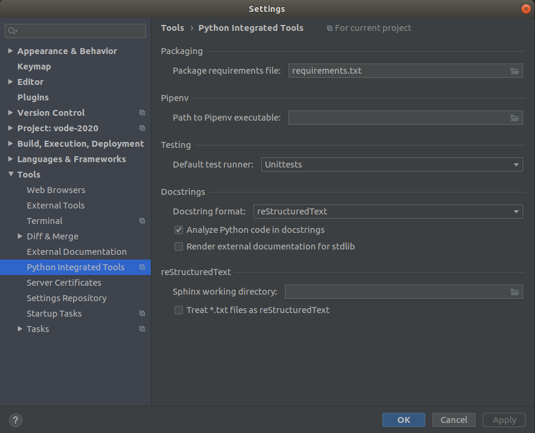

# Enable Pycharm Docstring

파이참에서 함수 아래서 `"""`을 누르고 엔터를 치면 자동으로 documentation string stub이 생성되는데 가끔 이게 안될때가 있다.  

그럴때는 아래처럼 Settings - Tools - Python Integrated Tools - Docstrings format 에서 "Plain"이 아닌 다른걸 선택하면 되는데 "reStructuredText"가 심플하고 좋다.

