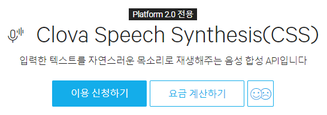
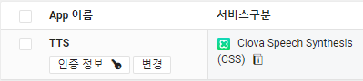

# Naver Clova Speech Synthesis (CSS)


네이버에서 제공하는 서비스로 텍스트를 음성으로 합성해주는 서비스  

텍스트를 서버로 보내면 합성된 음성을 mp4 형식의 데이터로 보내준다.  


## 서비스 신청

CSS 서비스는 아래 링크에서 신청할 수 있다.

<https://www.ncloud.com/product/aiService/css>

그러기 전에 먼저 네이버 클라우드 플랫폼에 회원가입도 하고 결재방법(카드)도 등록해야한다.  

처음 시작할 때 광고 좀 듣기로 하면 10만원 상당의 크레딧을 무료로 준다.  

로그인도 했고 결재정보도 등록했다면 링크에 들어가서 "**이용 신청하기**"를 누른다.



들어가면 세 가지 정보를 입력해야 한다.

1. Application 이름
2. Service 선택: "Clova Speech Synthesis (CSS)" 이건 꼭 선택해야겠죠?
3. 서비스 환경 등록: 나는 웹서비스에 사용할게 아니라서 그냥 "**Web 서비스 URL**"에 `http://localhost`로만 추가했다.

맨 아래 "**등록**"을 누르면 아래와 같이 서비스 목록이 나오는데 "**인증 정보**"를 누르면 `Client ID`와 `Client Secret`을 확인할 수 있다. 이 두 정보를 받아야만 API를 통해 음성을 받을 수 있다.




## 사용 방법

웹 API이기 때문에 특정 언어의 특정 패키지를 사용하지 않아도 된다.  

API 예제는 아래 링크에 여러가지 언어로 나와있다.  

<https://apidocs.ncloud.com/ko/ai-naver/clova_speech_synthesis/tts/>


리눅스에서는 간단히 `curl`을 이용하여 받을 수도 있다.  

```bash
curl "https://naveropenapi.apigw.ntruss.com/voice/v1/tts" \
	-d "speaker=mijin&speed=0&text=만나서 반갑습니다." \
	-H "Content-Type: application/x-www-form-urlencoded; charset=UTF-8" \
	-H "X-NCP-APIGW-API-KEY-ID: {애플리케이션 등록 시 발급받은 client id 값}" \
	-H "X-NCP-APIGW-API-KEY: {애플리케이션 등록 시 발급받은 client secret 값}" -v \
		> out.mp3
```

파이썬 예제는 다음과 같다.  

```python
// 네이버 음성합성 Open API 예제
import os
import sys
import urllib.request
client_id = "YOUR_CLIENT_ID"
client_secret = "YOUR_CLIENT_SECRET"
encText = urllib.parse.quote("반갑습니다 네이버")
data = "speaker=mijin&speed=0&text=" + encText;
url = "https://naveropenapi.apigw.ntruss.com/voice/v1/tts"
request = urllib.request.Request(url)
request.add_header("X-NCP-APIGW-API-KEY-ID",client_id)
request.add_header("X-NCP-APIGW-API-KEY",client_secret)
response = urllib.request.urlopen(request, data=data.encode('utf-8'))
rescode = response.getcode()
if(rescode==200):
    print("TTS mp3 저장")
    response_body = response.read()
    with open('1111.mp3', 'wb') as f:
        f.write(response_body)
else:
    print("Error Code:" + rescode)
```

여기서 중요한건 **`client_id`와 `client_secret`을 꼭 설정해야 한다**는 것이다.

나는 나름대로 코드를 다음과 같이 정리해봤다. `text_to_voice`라는 함수에 입력 텍스트 파일과 출력 mp4 파일의 경로를 지정해주면 자동으로 텍스트 파일을 읽어서 음성 변환 후 저장해주는 함수다.

```python
import urllib.request

client_id = "YOUR_CLIENT_ID"
client_secret = "YOUR_CLIENT_SECRET"
speaker = "mijin"
url = "https://naveropenapi.apigw.ntruss.com/voice/v1/tts"


def text_to_voice(textfile, voicefile):
    with open(textfile, "rt", encoding="utf-8") as f:
        text = f.read()
    print("text:", text)
    voice = pull_voice(text)
    save_voice(voice, voicefile)


def pull_voice(text):
    enc_text = urllib.parse.quote(text)
    data = f"speaker={speaker}&speed=0&text={enc_text}"
    request = urllib.request.Request(url)
    request.add_header("X-NCP-APIGW-API-KEY-ID", client_id)
    request.add_header("X-NCP-APIGW-API-KEY", client_secret)
    request.add_header("Content-Type", "application/x-www-form-urlencoded")
    response = urllib.request.urlopen(request, data=data.encode('utf-8'))
    rescode = response.getcode()
    assert rescode == 200, "Error Code:" + rescode
    return response.read()


def save_voice(voice, voicefile):
    print("음성 파일 저장:", voicefile)
    with open(voicefile, 'wb') as f:
        f.write(voice)


if __name__ == "__main__":
    text_to_voice("script.txt", "voice.mp4")
```


## 목소리 설정

목소리는 언어별로 남여 목소리가 하나씩 있다. 위 코드에서 `speaker`를 바꾸면 된다.

- mijin : 한국어, 여성 음색
- jinho : 한국어, 남성 음색
- clara : 영어, 여성 음색
- matt : 영어, 남성 음색
- shinji : 일본어, 남성 음색
- meimei : 중국어, 여성 음색
- liangliang : 중국어, 남성 음색
- jose : 스페인어, 남성 음색
- carmen : 스페인어, 여성 음색
