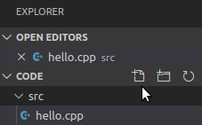

# vscode


개인적으로 Visual Studio 싫어하기 때문에 그동안 크로스 플랫폼을 지원하는 IDE인 QtCreator를 쓰다가 이제서야 Visual Studio Code (vscode)를 써보기로 했다. Atom이나 Sublime Text처럼 컴파일러 없이 Editing 기능 위주로 되어있고 리눅스에서 설치되고 gcc를 사용할 수 있고 이제는 vscode가 주류가 된지 한참 됐기 때문에 나도 흐름을 따라 보려고 한다.


## vscode 설치

```
# gcc/g++ 설치
sudo apt install build-essential
# 설치
sudo snap install code --classic
# 삭제
sudo snap remove code
# 실행
code
```

vscode를 실행하면 왼쪽에 이런 버튼들이 있다. 버튼에 따라 왼쪽 패널의 내용이 전환된다. 여기 다섯 개의 화면을 잘 알아야 vscode를 잘 쓸 수 있다.


- Explorer (Ctrl+Shift+E): 프로젝트 디렉토리 내부의 파일들을 보여준다.
- Search (Ctrl+Shift+F): 프로젝트에서 특정 키워드를 찾거나 교체(replace)할 수 있다.
- Source Control (Ctrl+Shift+G): Git과 같은 버전관리 시스템을 GUI로 사용할 수 있다.
- Debug and Run (Ctrl+Shift+D): 디버깅 모드로 실행한다.
- Extensions (Ctrl+Shift+X): 확장 플러그인들을 검색하고 설치할 수 있다.


## Extensions 설치

vscode는 거의 모든 프로그래밍 언어를 개발할 수 있는 플랫폼 역할을 하고 이 위에 수많은 확장 플러그인(extensions)들이 있다. 특정 언어를 사용하기 위해서는 그에 맞는 플러그인을 설치해야 한다. C/C++을 사용하기 위해서는 `C/C++` 확장을 설치해야 한다.  

오른쪽 "Extensions" 버튼을 누르고 `C/C++`을 검색 후 녹색 "install" 버튼을 눌러 설치한다.


## 개발 환경 설정

여기선 간단한 예제 프로젝트를 통해서 C++ 빌드 환경을 설정하는 방법을 설명한다.

### 1. 프로젝트 생성

[File] - [Open Folder]를 눌러 새로운 프로젝트 디렉토리(여기선 "code"란 디렉토리)를 연다.  

"Explorer" 창에서 `src` 디렉토리를 만들고 그 아래 `hello.cpp` 파일을 만든다. 아래 그림에서 마우스가 가리키는 아이콘이 "New File"이고 그 옆이 "New Folder"다.



`hello.cpp` 파일은 다음과 같이 작성한다.

```
#include <iostream>
int main()
{
    std::cout << "Hello code" << std::endl;
    return 0;
}
```


### 2. 빌드 및 실행 설정

vscode는 특정 언어를 위해 만들어진게 아니라 범용 편집기이기 때문에 코드만 짠다고 바로 돌릴순 없다. 코드를 빌드할 컴파일러와 옵션을 지정해줘야 한다. 이를 위해 `tasks.json` 파일을 작성한다.

[Terminal] - [Configure Default Build Task]를 누르면 현재 작성중인 언어에 맞춰서 `json.tasks`의 기본 템플릿을 고를 수 있다. 혹은 그냥 빌드 명령어인 `Ctrl+Shift+B`를 눌러도 된다. 옵션 중에 "C/C++: g++ build active file"을 선택한다. `g++` 컴파일러를 이용해 빌드 명령시 선택한 파일(active file)을 빌드하는 설정을 하는 것이다. 기본 템플릿은 다음과 같다.

```json
{
    // See https://go.microsoft.com/fwlink/?LinkId=733558 
    // for the documentation about the tasks.json format
    "version": "2.0.0",
    "tasks": [
        {
            "type": "shell",
            "label": "g++ build active file",
            "command": "/usr/bin/g++",
            "args": [
                "-g",
                "${file}",
                "-o",
                "${fileDirname}/${fileBasenameNoExtension}"
            ],
            "options": {
                "cwd": "/usr/bin"
            },
            "problemMatcher": [
                "$gcc"
            ],
            "group": {
                "kind": "build",
                "isDefault": true
            }
        }
    ]
}
```

- type: `shell` or `process`. `shell` 이면 "command"를 쉘 명령어로서 실행, `process`면 프로세스 실행?
- label: 작업의 이름, 빌드 단축기 Ctrl+Shift+B 를 눌렀을 때 선택할 이름
- command: 빌드를 실행할 컴파일러
- args: `command`의 인자
- cwd: Current Working Directory
- presentation: 실행했을 때 출력을 어떻게 보여줄지를 설정, 자세한 내용은 [Output behaviour](<https://code.visualstudio.com/docs/editor/tasks#_output-behavior>) 참조
- problemMatcher: Warning이나 Error 문을 보여주는 형식 지정, 자세한 내용은 [Defining a problem matcher](<https://code.visualstudio.com/docs/editor/tasks#_defining-a-problem-matcher>) 참조

기본 템플릿을 다음과 같이 수정하였다.

```json
{
    // See https://go.microsoft.com/fwlink/?LinkId=733558 
    // for the documentation about the tasks.json format
    "version": "2.0.0",
    "tasks": [
        {
            "type": "shell",
            "label": "g++ build,
            "command": "/usr/bin/g++",
            "args": [
                "-g",
                "${file}",
                "-o",
                "${fileDirname}/${fileBasenameNoExtension}"
            ],
            "problemMatcher": {
            // The problem is owned by the cpp language service.
            "owner": "cpp",
            // The file name for reported problems is relative to the opened folder.
            "fileLocation": ["relative", "${workspaceFolder}"],
            // The actual pattern to match problems in the output.
            "pattern": {
                // The regular expression.
                "regexp": "^(.*):(\\d+):(\\d+):\\s+(warning|error):\\s+(.*)$",
                "file": 1,
                "line": 2,
                "column": 3,
                "severity": 4,
                "message": 5
              }
            },
            "group": {
                "kind": "build",
                "isDefault": true
            }
        }
		{
            "label": "execute"
            "command": "cd {fileDirName} && ./${fileBasenameNoExtension}",
            "group": "test"
        }
    ]
}
```


https://yjcode.tistory.com/1

<https://code.visualstudio.com/docs/editor/tasks#_defining-a-problem-matcher>

https://webnautes.tistory.com/1158

https://yjcode.tistory.com/3

